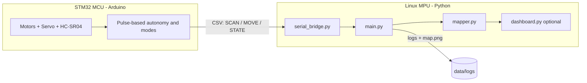

# DARKMAP-Q

**Offline GPS-Denied Reconnaissance Mapping Rover using Arduino UNO Q**

DARKMAP-Q is a proof-of-concept reconnaissance sensing payload that explores and
maps pitch-black, GPS-denied environments with no internet connection. A
servo-mounted ultrasonic sensor scans the surroundings, the rover avoids
obstacles autonomously, and an onboard Linux process builds a rough 2D map.

## Problem

Indoor, underground, and signal-denied spaces have no GPS and often no light.
Operators need a way to scout these spaces before entering. Cameras fail in
total darkness, and cloud-dependent systems fail without connectivity.

## Solution

Use the dual-compute **Arduino UNO Q**:

- **MCU side (STM32U585, Arduino):** real-time motor control, servo sweep,
  ultrasonic timing, and pulse-based obstacle avoidance.
- **Linux side (Qualcomm QRB2210, Python):** parse telemetry, estimate pose,
  build/save a 2D map, classify the local scene, and serve a local dashboard.

Ultrasonic sensing needs no light, so the system maps in complete darkness, and
everything runs offline.

## Hardware

- Arduino UNO Q
- RC car chassis + DC motors + motor driver board
- SG90 servo + HC-SR04 ultrasonic sensor (ECHO level-shifted to 3.3 V)
- Motor battery pack, common ground, 5 V / 3 A USB-C board supply
- Optional: MPU6050 IMU, camera

See [docs/wiring.md](docs/wiring.md) for the full pin map, the required HC-SR04
voltage divider, and power/ground rules.

## Architecture



### Telemetry format (CSV lines over serial)

```text
SCAN,timestamp_ms,angle_deg,distance_cm,mode
MOVE,timestamp_ms,action,duration_ms,speed      # action: FORWARD/BACKWARD/TURN_LEFT/TURN_RIGHT/STOP
STATE,timestamp_ms,mode,message                 # mode: AUTO/MANUAL/SCAN_ONLY/STOP
```

## Repository layout

```text
arduino/darkmap_rover.ino   MCU sketch (motors, servo, ultrasonic, autonomy, telemetry)
linux/serial_bridge.py      Telemetry sources: serial / file / stdin / built-in simulator
linux/mapper.py             Pose dead-reckoning, scan->XY, live map, PNG/CSV export
linux/main.py               Orchestrator: parse packets, log, map, scene tag
linux/scene.py              Rule-based scene classification (edge logic)
linux/dashboard.py          Optional offline Flask dashboard
linux/requirements.txt      Python dependencies
docs/                       wiring.md, demo_script.md, pitch.md
data/logs/                  Session CSVs, points CSV, map.png (gitignored)
```

## Run the Arduino side

1. Open `arduino/darkmap_rover.ino` in Arduino App Lab (UNO Q) or the Arduino IDE.
2. Verify the pin constants at the top of the sketch against your wiring.
3. Wire the HC-SR04 ECHO through a voltage divider (see wiring guide). **Do not**
   connect ECHO directly to a 3.3 V input.
4. Upload to the MCU. On boot you should see `STATE,<ms>,STOP,boot_ok`.
5. Send single-character commands over serial to control modes:
   - `a` = AUTO, `m` = MANUAL, `o` = SCAN_ONLY, `x` = STOP
   - In MANUAL: `i` forward, `k` back, `j` left, `l` right, space = stop

> Servo control uses the Arduino `Servo` library. If it is unavailable on your
> UNO Q core build, swap to the board's PWM/servo API; the rest of the sketch is
> unchanged.

## Run the Python mapping side

```bash
cd linux
pip install -r requirements.txt   # matplotlib (+ pyserial for live, Flask for dashboard)
```

No hardware? Use the built-in simulator (a virtual "rover in a box"):

```bash
python3 main.py --source sim            # live 2D map window
python3 main.py --source sim --no-plot  # headless; writes data/logs/map.png
```

Live rover over serial:

```bash
python3 main.py --source serial --port /dev/ttyACM0
```

Replay a saved session log:

```bash
python3 main.py --source file --file ../data/logs/session_YYYYMMDD_HHMMSS.csv
```

Each run writes to `data/logs/`:

- `session_<timestamp>.csv` - raw telemetry log
- `points_<timestamp>.csv` - path + obstacle point cloud
- `map.png` - rendered 2D map
- `status.json` - latest mode/scene/distance (used by the dashboard)

### Optional offline dashboard

```bash
python3 dashboard.py        # serves http://127.0.0.1:8000 (offline, no cloud)
```

## Demo

See [docs/demo_script.md](docs/demo_script.md) for the full judging flow, the
no-hardware backup, and fallback modes. Pitch material is in
[docs/pitch.md](docs/pitch.md).

## Safety / voltage warning

The UNO Q is a **3.3 V logic** board, not a 5 V Arduino Uno. The HC-SR04 ECHO is
typically 5 V and **must** be level-shifted (voltage divider or level shifter)
before reaching the board. Do not use D3 for ECHO. Do not power motors or a
stalling servo directly from the UNO Q. Keep all grounds common. Details in
[docs/wiring.md](docs/wiring.md).

## Known limitations

- Ultrasonic mapping is rough, not LiDAR-quality.
- No wheel encoders, so the dead-reckoning pose drifts over time. Use short,
  slow runs; tune `SPEED_CM_PER_SEC` / `TURN_DEG_PER_SEC` in `mapper.py`.
- Thin, soft, or sharply angled surfaces may be missed by ultrasonic.
- A normal camera does not help in total darkness without IR illumination.
- This is a proof-of-concept, not military-grade autonomy.

## Future improvements

Wheel encoders + IMU fusion, 2D LiDAR, IR/thermal camera, multi-rover mesh
communication, and a drone-compatible mounting bracket for the payload.
