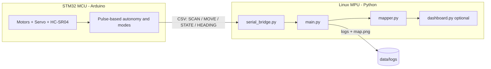

# DARKMAP-Q

**Offline GPS-Denied Reconnaissance Mapping Rover using Arduino UNO Q**

DARKMAP-Q is a proof-of-concept reconnaissance sensing payload that explores and
maps pitch-black, GPS-denied environments with no internet connection. A
servo-mounted ultrasonic sensor scans the surroundings, the rover avoids
obstacles autonomously, and an onboard Linux process builds a rough 2D map.

## Quick start (live run over Wi-Fi, no router, no internet)

Telemetry streams from the board to the laptop over the laptop's own Wi-Fi
hotspot. Roles: the laptop is the Wi-Fi host **and** the TCP server; the UNO Q
joins the hotspot and connects out to it.

**1. Laptop - turn on the hotspot (one time):**
- Settings -> Network & Internet -> Mobile hotspot -> On (set an SSID/password,
  share over Wi-Fi). The laptop becomes `192.168.137.1`.
- Allow the telemetry port through the firewall (admin PowerShell, one time):
  ```powershell
  netsh advfirewall firewall add rule name="DARKMAP net 9009" dir=in action=allow protocol=TCP localport=9009
  ```

**2. UNO Q - join the hotspot (one time):**
```bash
./linux/join_hotspot.sh "<SSID>" "<PASSWORD>"   # should print gateway 192.168.137.1
```

**3. Laptop - start the receiver (headless; dashboard provides the view):**
```powershell
cd linux
python main.py --source net --no-plot
```

**4. Laptop - start the offline dashboard (second terminal):**
```powershell
cd linux
python dashboard.py
```
Open http://127.0.0.1:8000 (add `--host 0.0.0.0` to view from a phone on the
hotspot at http://192.168.137.1:8000).

**5. UNO Q - run the rover:** launch the App Lab project (`arduino/working.ino`
on the MCU + `linux/uno_q_forwarder.py` on the Linux side). When connected the
laptop prints `[net] client connected from 192.168.137.x`.

**6. Press the rover's button** to enter `WALLFOLLOW`. Telemetry starts flowing
and the map fills in. Press again to STOP.

> No hardware? Skip steps 1-2 and 5-6 and run the simulator instead:
> `python main.py --source wallsim --room square:300 --sim-steps 300` (then open
> the dashboard).

## Problem

Indoor, underground, and signal-denied spaces have no GPS and often no light.
Operators need a way to scout these spaces before entering. Cameras fail in
total darkness, and cloud-dependent systems fail without connectivity.

## Solution

Use the dual-compute **Arduino UNO Q**:

- **MCU side (STM32U585, Arduino):** real-time motor control, servo sweep,
  ultrasonic timing, and pulse-based obstacle avoidance.
- **Linux side (Qualcomm QRB2210, Python):** parse telemetry, estimate pose,
  build/save a 2D map, classify the local scene, and serve a local dashboard.

Ultrasonic sensing needs no light, so the system maps in complete darkness, and
everything runs offline.

## Hardware

- Arduino UNO Q
- RC car chassis + DC motors + motor driver board
- SG90 servo + HC-SR04 ultrasonic sensor (ECHO level-shifted to 3.3 V)
- Motor battery pack, common ground, 5 V / 3 A USB-C board supply
- MPU6050 gyro (I2C: SDA=A4, SCL=A5, **3.3 V** power) for exact turns + map heading
- Optional: camera

See [docs/wiring.md](docs/wiring.md) for the full pin map, the required HC-SR04
voltage divider, and power/ground rules.

## Architecture



### Telemetry format (CSV lines over serial)

```text
SCAN,timestamp_ms,angle_deg,distance_cm,mode
MOVE,timestamp_ms,action,duration_ms,speed      # action: FORWARD/BACKWARD/TURN_LEFT/TURN_RIGHT/STOP
STATE,timestamp_ms,mode,message                 # mode: AUTO/MANUAL/SCAN_ONLY/WALLFOLLOW/STOP
HEADING,timestamp_ms,yaw_deg                    # optional; MPU6050 gyro (CCW-positive degrees)
```

## Repository layout

```text
arduino/darkmap_rover.ino   MCU sketch (motors, servo, ultrasonic, autonomy, telemetry)
linux/serial_bridge.py      Telemetry sources: serial / file / stdin / built-in simulator
linux/mapper.py             Pose dead-reckoning, scan->XY, live map, detection tags, PNG/CSV export
linux/main.py               Orchestrator: parse packets, log, map, scene tag, fuse detections
linux/scene.py              Rule-based scene classification (edge logic)
linux/detector.py           Camera + YOLO recon object detection (offline, optional)
linux/test_detector.py      Standalone webcam/model test for the detector
linux/dashboard.py          Optional offline Flask dashboard
linux/requirements.txt      Python dependencies
docs/                       wiring.md, demo_script.md, pitch.md
data/logs/                  Session CSVs, points CSV, detections CSV, map.png (gitignored)
```

## Run the Arduino side

1. Open `arduino/darkmap_rover.ino` in Arduino App Lab (UNO Q) or the Arduino IDE.
2. Verify the pin constants at the top of the sketch against your wiring.
3. Wire the HC-SR04 ECHO through a voltage divider (see wiring guide). **Do not**
   connect ECHO directly to a 3.3 V input.
4. Upload to the MCU. On boot you should see `STATE,<ms>,STOP,boot_ok`.
5. Send single-character commands over serial to control modes:
   - `a` = AUTO, `m` = MANUAL, `o` = SCAN_ONLY, `x` = STOP
   - In MANUAL: `i` forward, `k` back, `j` left, `l` right, space = stop

> Servo control uses the Arduino `Servo` library. If it is unavailable on your
> UNO Q core build, swap to the board's PWM/servo API; the rest of the sketch is
> unchanged.

## Run the Python mapping side

```bash
cd linux
pip install -r requirements.txt   # matplotlib (+ pyserial for live, Flask for dashboard)
```

No hardware? Use the built-in simulator (a virtual "rover in a box"):

```bash
python3 main.py --source sim            # live 2D map window
python3 main.py --source sim --no-plot  # headless; writes data/logs/map.png
```

Live rover over serial:

```bash
python3 main.py --source serial --port /dev/ttyACM0
```

Replay a saved session log:

```bash
python3 main.py --source file --file ../data/logs/session_YYYYMMDD_HHMMSS.csv
```

Each run writes to `data/logs/`:

- `session_<timestamp>.csv` - raw telemetry log
- `points_<timestamp>.csv` - path + obstacle point cloud (+ detection rows)
- `detections_<timestamp>.csv` - recon detections (only if any were seen)
- `map.png` - rendered 2D map
- `status.json` - latest mode/scene/distance/detections (used by the dashboard)

## Reconnaissance object detection (YOLO)

DARKMAP-Q fuses two sensing channels into one tagged recon map:

- **Distance sensors** answer *where* something is (front ultrasonic reading).
- **Camera + YOLO** answer *what* it is (object class).
- The **mapper/dashboard** combine them into a tagged 2D reconnaissance map.

Detection runs locally with OpenCV + Ultralytics YOLO (`yolov8n.pt`). It is
**on by default** when a camera and the model are available, runs in a
background thread so it never blocks navigation/mapping, and **degrades
gracefully** — if the camera, model, or packages are missing the rest of the
system runs normally.

### Setup

```bash
cd linux
pip install -r requirements.txt   # includes opencv-python + ultralytics
```

The first run downloads `yolov8n.pt` once (needs internet that one time).
After that the cached model runs fully offline. No cloud APIs are used.

### Test the camera + model alone

```bash
python3 test_detector.py           # print detections every frame
python3 test_detector.py --show    # annotated preview window
python3 test_detector.py --once    # single frame then exit
python3 test_detector.py --camera 1 --model yolov8n.pt --conf 0.5
```

### Detection flags for `main.py`

```bash
python3 main.py --source serial --port /dev/ttyACM0          # detection auto-on
python3 main.py --source sim --no-detect                     # disable detection
python3 main.py --source serial --camera 1 --detect-conf 0.5 # tune camera/threshold
python3 main.py --source serial --detect-cooldown 5          # secs between tags/category
```

### Mission categories

Only these object classes are kept; everything else is ignored. Detections are
tagged neutrally for reconnaissance review only — nothing is labeled a weapon,
threat, or danger.

| Category | Objects |
|---|---|
| human | person |
| bag | backpack, suitcase, handbag |
| electronics | cell phone, laptop |
| environment | chair, bottle, table |

Tags are placed on the map using the latest front ultrasonic distance along the
rover heading. If no distance is available the tag is placed just ahead of the
rover with `note=distance_unknown`.

### Optional offline dashboard

```bash
python3 dashboard.py        # serves http://127.0.0.1:8000 (offline, no cloud)
```

## Demo

See [docs/demo_script.md](docs/demo_script.md) for the full judging flow, the
no-hardware backup, and fallback modes. Pitch material is in
[docs/pitch.md](docs/pitch.md).

## Safety / voltage warning

The UNO Q is a **3.3 V logic** board, not a 5 V Arduino Uno. The HC-SR04 ECHO is
typically 5 V and **must** be level-shifted (voltage divider or level shifter)
before reaching the board. Do not use D3 for ECHO. Do not power motors or a
stalling servo directly from the UNO Q. Keep all grounds common. Details in
[docs/wiring.md](docs/wiring.md).

## Known limitations

- Ultrasonic mapping is rough, not LiDAR-quality.
- No wheel encoders, so the dead-reckoning pose drifts over time. Use short,
  slow runs; tune `SPEED_CM_PER_SEC` / `TURN_DEG_PER_SEC` in `mapper.py`.
- Thin, soft, or sharply angled surfaces may be missed by ultrasonic.
- YOLO object detection needs visible light (or IR illumination); in total
  darkness ultrasonic mapping still works but the camera tags will not.
- Detection bearing is approximate (single forward camera); tags are placed at
  the front ultrasonic distance along the heading, not triangulated.
- This is a proof-of-concept, not military-grade autonomy.

## Future improvements

Wheel encoders + IMU fusion, 2D LiDAR, IR/thermal camera, multi-rover mesh
communication, and a drone-compatible mounting bracket for the payload.
